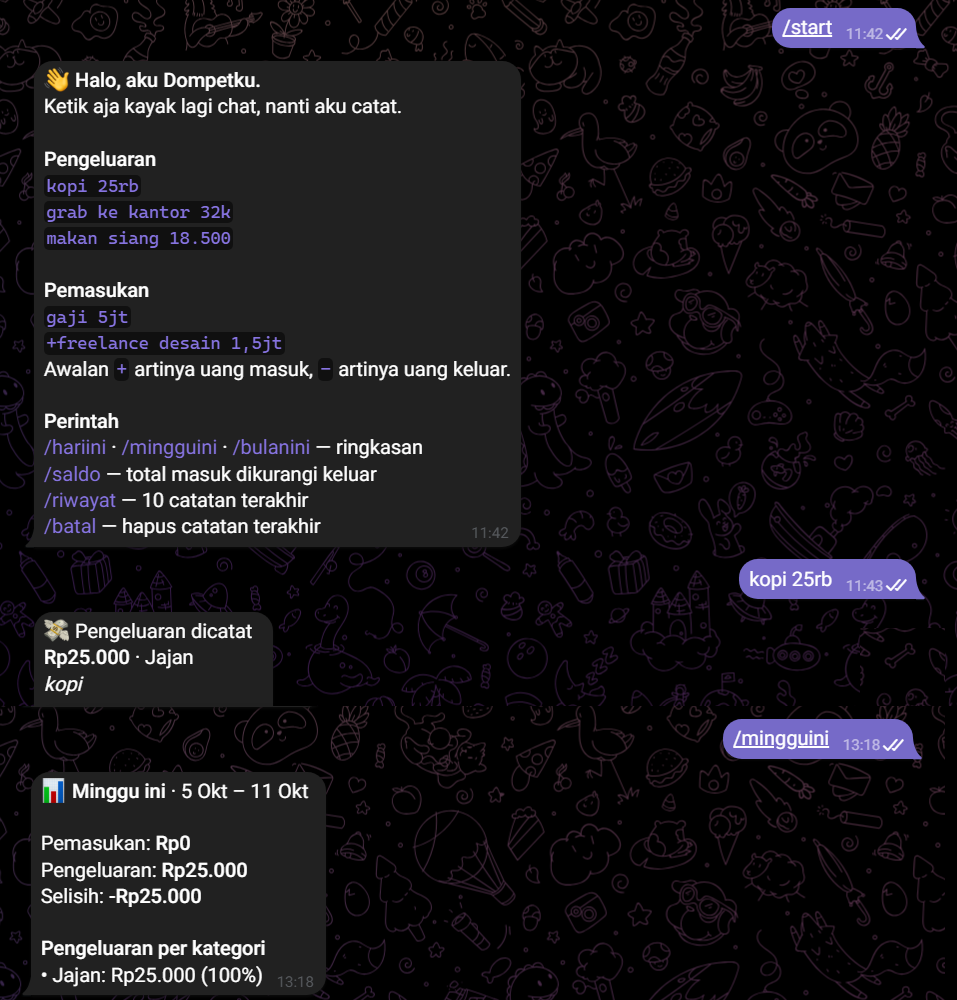

<p align="center">
  
</p>

<h1 align="center">Dompetku</h1>

<p align="center">
  <a href="https://github.com/ayndri/Bot-Dompet/actions/workflows/test.yml"></a>
  
</p>

**Bot Telegram pencatat pemasukan dan pengeluaran.** Ketik kayak lagi chat,
`kopi 25rb` atau `gaji 5jt`, dan bot mencatat nominal, jenis, dan kategorinya.

Ditulis dengan **Go**, jalan sebagai fungsi serverless di **Vercel**, data di
**Neon Postgres**.

<p align="center">
  
</p>

## Fitur

- **Bahasa santai.** Paham `25rb`, `32k`, `1,5jt`, `18.500`, `Rp25.000`.
  Kalau ada beberapa angka (`2 kopi 50rb`), angka bersatuan yang dipakai.
- **Jenis dan kategori otomatis.** `gaji`, `bonus`, `refund` dianggap pemasukan.
  `grab`, `bensin`, `parkir` masuk Transport, dan seterusnya.
  Awalan `+` atau `-` memaksa jenisnya.
- **Ringkasan** `/hariini`, `/mingguini`, `/bulanini`, plus `/saldo` dan `/riwayat`.
- **`/batal`** menghapus catatan terakhir kalau salah ketik.
- **Tidak dobel.** Telegram kadang mengirim ulang pesan yang sama; setiap
  `update_id` hanya dicatat sekali (unique constraint di database).
- **Bisa dibuat pribadi** lewat `ALLOWED_CHAT_IDS`.

## Arsitektur

```
Telegram ──POST──▶ api/webhook.go  (Vercel, cek secret header)
                        │
                        ▼
                   bot/            perintah, ringkasan, format balasan
                    │      │
                    ▼      ▼
              ledger/    store/    Postgres (Neon)
       parse, kategori,
       format rupiah
```

| Folder | Isi |
|---|---|
| `ledger/` | Aturan inti tanpa I/O: membaca pesan, kategori, format rupiah. |
| `bot/` | Logika percakapan. Bergantung pada interface `Store` dan `Sender`, jadi bisa dites tanpa database dan tanpa Telegram. |
| `store/` | Query Postgres dengan `pgx`. Skema di `store/schema.sql`. |
| `telegram/` | Klien Bot API kecil, tanpa library pihak ketiga. |
| `api/` | Entry point serverless Vercel. |
| `cmd/` | `dev` (jalan lokal), `migrate` (buat tabel), `setwebhook` (daftarkan URL). |

## Menjalankan di laptop

Butuh Go 1.25+, akun Neon, dan bot dari [@BotFather](https://t.me/BotFather).
Untuk development, bikin **bot kedua** khusus lokal.

```bash
cp .env.example .env        # isi token bot lokal dan DATABASE_URL
go run ./cmd/migrate        # buat tabel
go run ./cmd/dev            # bot jalan, coba chat dia di Telegram
go test ./...
```

## Deploy ke Vercel

1. Push repo ke GitHub, lalu import di Vercel (framework: **Other**).
2. Isi Environment Variables: `TELEGRAM_BOT_TOKEN`, `TELEGRAM_WEBHOOK_SECRET`,
   `DATABASE_URL`, dan opsional `ALLOWED_CHAT_IDS`.
3. Setelah deploy, daftarkan webhook dari laptop (pakai token bot produksi):

   ```bash
   go run ./cmd/setwebhook -url https://<nama-project>.vercel.app
   ```

## Rencana berikutnya

- [ ] Laporan mingguan otomatis tiap Minggu malam (cron)
- [ ] Grafik pengeluaran per kategori dikirim sebagai gambar
- [ ] Batas budget per kategori dengan peringatan di 80%
- [ ] Tombol pilihan kategori saat bot tidak yakin
